# Bitcoin sentiment and price analysis. Search for patterns affecting price changes. 

---
### Table of contents:
1. Twitter sentiment analysis and its importance for business analysis
2.  Sentiment analysis as an additional component for trading algorithms
3. Data sourcing
4. Data overview and statistics
5. Neural network classification model
6. Exploratory data analysis and results
7. Summary and next staps


<br />

### 1. Twitter sentiment analysis and its importance for business analysis
 
Sentiment analysis refers to identifying as well as classifying the sentiments that are expressed in the text source. It aims to analyze people's sentiments, attitudes, opinions, emotions, etc. towards elements such as products, individuals, topics ,organizations, and services.


Why Twitter? The problem is to understand your audience, keep on top of what’s being said about your brand – and your competitors – but also discover new trends in the industry. Twitter sentiment analysis allows you to keep track of what's being said about your product or service on social media, and can help you detect angry customers or negative mentions before they escalate.

**Twitter Sentiment Analysis Use Cases**

Twitter sentiment analysis provides many exciting opportunities for businesses. Being able to analyze tweets, and determine the sentiment of each message, adds a new dimension to social media monitoring. The examples of the most popular use cases are the following:

- Social Media Monitoring
- Customer Service
- Market Research
- Political Campaigns

Of course there are many more cases where sentiment analysis can be used to provide valuable feedback. In this project we’re exploring how analyzing the Twitter content can help in finding micro patterns that could be a trigger for a price change. A use case for this analysis could be a trading algorithm.

<br />

### 2. Sentiment analysis as an additional component for trading algorithms

#### *`“With this study, we understood that Bots only depend upon indicators, whereas the volatility induced by Elon Musk tweets or the sentiment due to Chinese government ban on crypto was not embedded. And it requires a human to intervene now and then. “`*


Trading bots mostly depend on the technical analysis and typical trading indicators and patterns. While this can be good for the stock market, it might fail with the cryptocurrencies due to the high volatility.
To improve the accuracy and returns of the cryptocurrency trading algorithms, we could add a sentiment analysis component to track investors’ emotions towards cryptocurrencies. This feature could be another indicator to improve crypto trading[^1]. 

<br />

### 3. Data Sourcing

**Twitter Data**

The data used in this project falls into two groups - Twitter content and BTC price data.
The tweets were downloaded directly from Twitter using Twitter API and Python library - tweetpy. The tweet content was also split into 3 csv files that include respectively: 

- tweets data that includes basic tweets information and public metrics:

```
tweet _id, author_id, created_at 
source
public_metrics["retweet_count"]
public_metrics["reply_count"] 
public_metrics["like_count"] 
public_metrics["like_count"]
text
```


- author data

```
author_id, 
username, 
public_metrics["followers_count"]
public_metrics["following_count"]
public_metrics["tweet_count"]
public_metrics["listed_count"]
```
- tweet counts for each day. 

Characteristic of the API query:
- query= *```"(#btc OR #bitcoin OR bitcoin) is:verified -has:media -is:retweet lang:en"```*
- Due to the API limitations, the tweets’ data can only include the last 7 days. 
- tweets were only sourced from the verified users with significant audience
- Tweets were written in english to allow easy analysis
- Tweets don’t include any images or videos to focus only on text content classification

**BTC Price Data**

The bitcoin price data was sourced directly from min-api.cryptocompare.com to obtain hourly price data. 
BTC price data was saved as a csv file and contain information like:

```
{'time': 1642748400,
 'high': 39173.58,
 'low': 38575.8,
 'open': 38697.49,
 'volumefrom': 1758.17,
 'volumeto': 68334552.69,
 'close': 39142.31,
```

Characteristic of the API query:
```
payload = {
    "api_key": apiKey,
    "fsym": "BTC",
    "tsym": "USD",
    "limit": 250
```

The price data includes last 250 hours (last 10 days)


**Importance of data features for sentiment and price analysis**

The most important element of the twitter data is the text content which allows it to perform the sentiment analysis. However, other elements like twitter counts, author id or the amount of followers and retweets may also affect the price to some degree. 

**Limitations**

Major limitation that doesn’t allow for more deep exploration and analysis is the twitter API limit. Without access to the academic account there is no possibility to download the historical data, only the last 7 days. 

The twitter data also doesn;t include other major languages and geo data which may have a significant impact on the results. 


### 4. Data Overview and Statistics

**Tweet data**


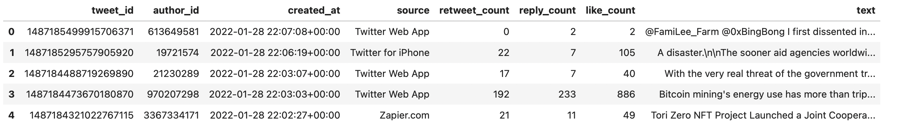

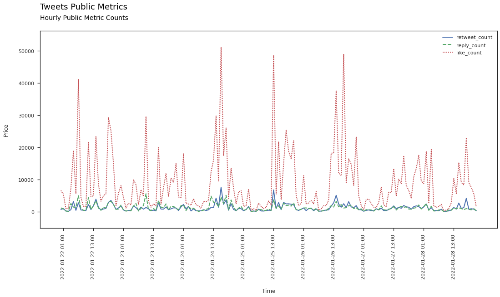

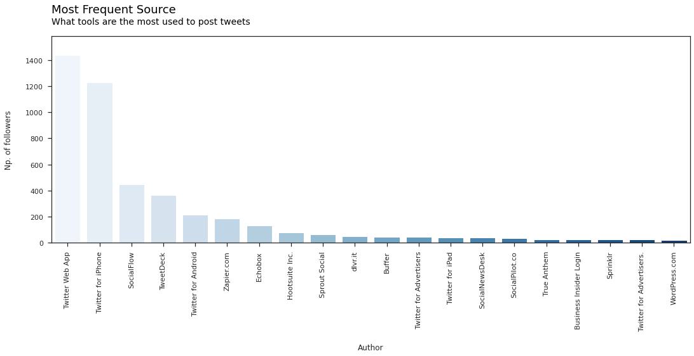


**Author data**

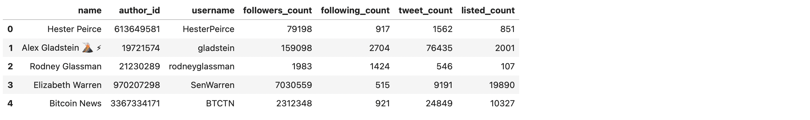

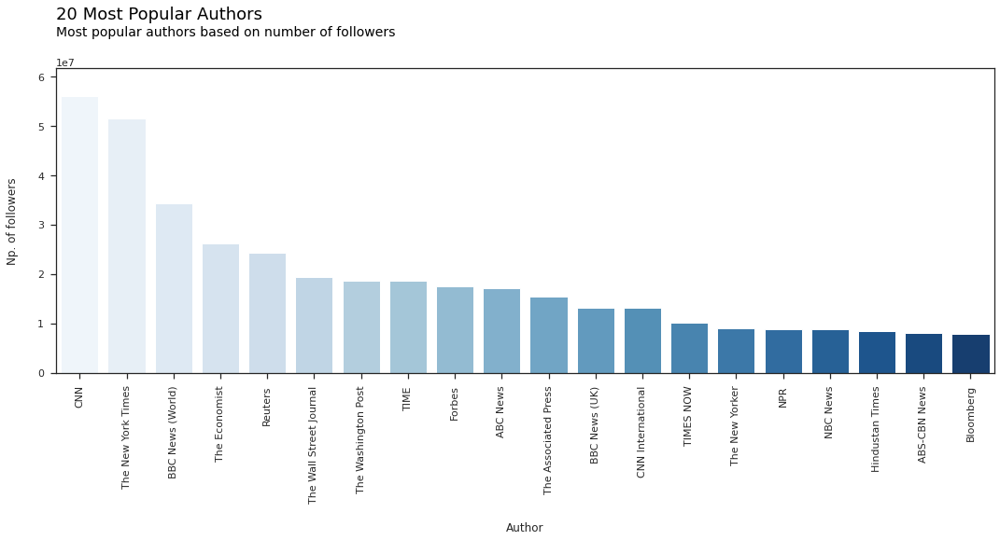


**Tweet Counts**

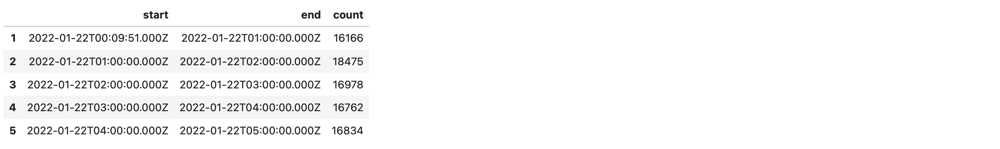

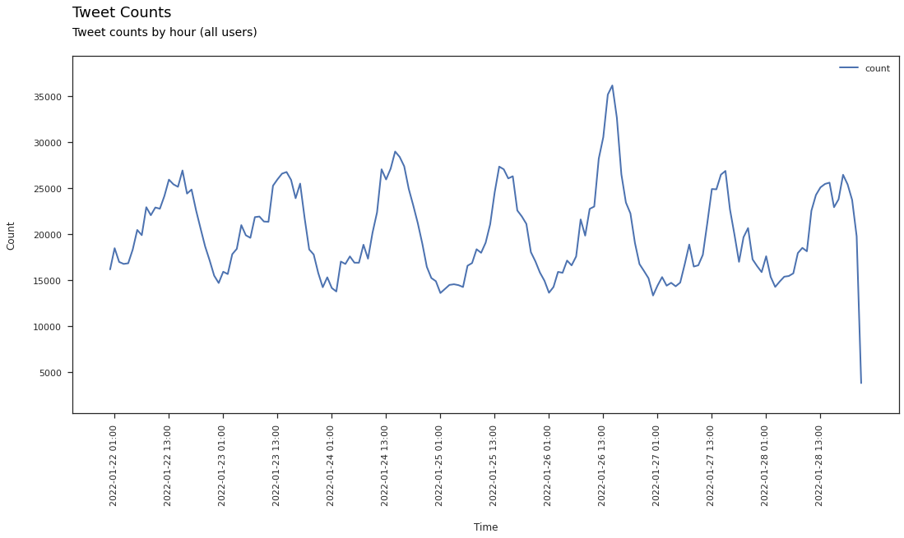


**Bitcoin Price**

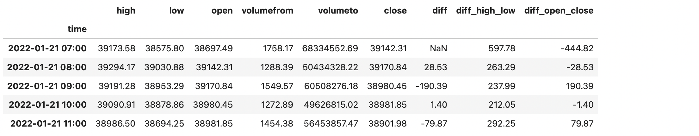

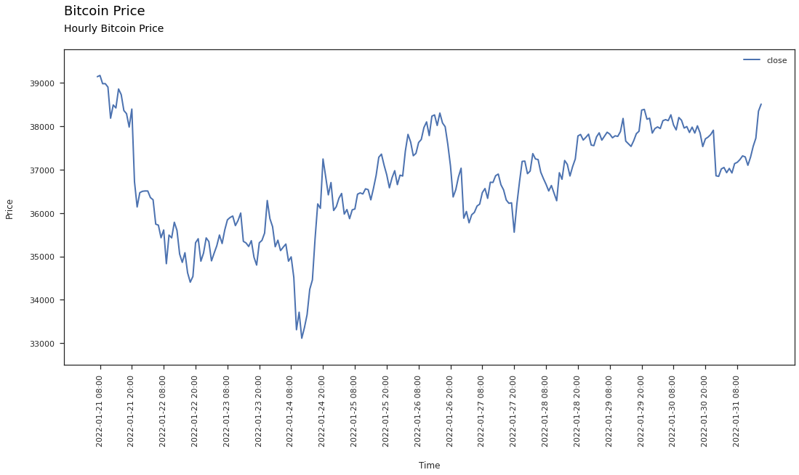

<br />
<br />


## 5. Neural network Classification Model and NLP

**Process Steps Diagram**

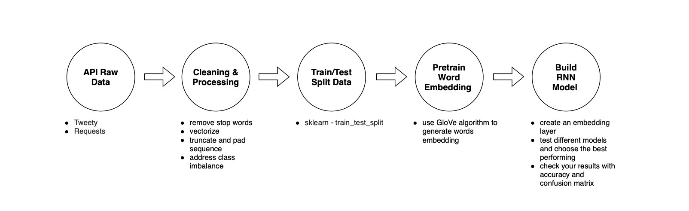

**Raw Data Labeling Process**

For the best results twitter text content should be labeled manually, however in this case, due to time constraints, Twitter data was labeled using VADER (Valence Aware Dictionary and sEntiment Reasoner). 

Vader is a lexicon and rule-based sentiment analysis tool that is specifically attuned to sentiments expressed in social media. VADER uses a combination of A sentiment lexicon is a list of lexical features (e.g., words) which are generally labeled according to their semantic orientation as either positive or negative. VADER not only tells about the Positivity and Negativity score but also tells us about how positive or negative a sentiment is[^2].

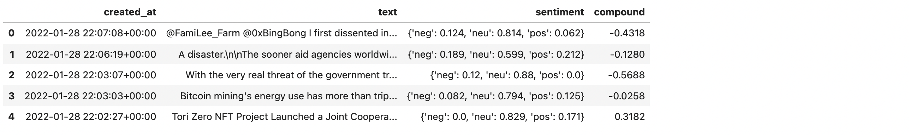

The Compound score is a metric that calculates the sum of all the lexicon ratings which have been normalized between -1(most extreme negative) and +1 (most extreme positive).
- positive sentiment : (compound score >= 0.05) 
- neutral sentiment : (compound score > -0.05) and (compound score < 0.05) 
- negative sentiment : (compound score <= -0.05)

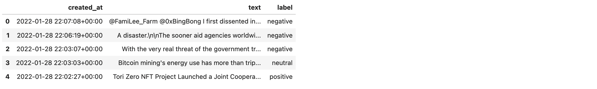

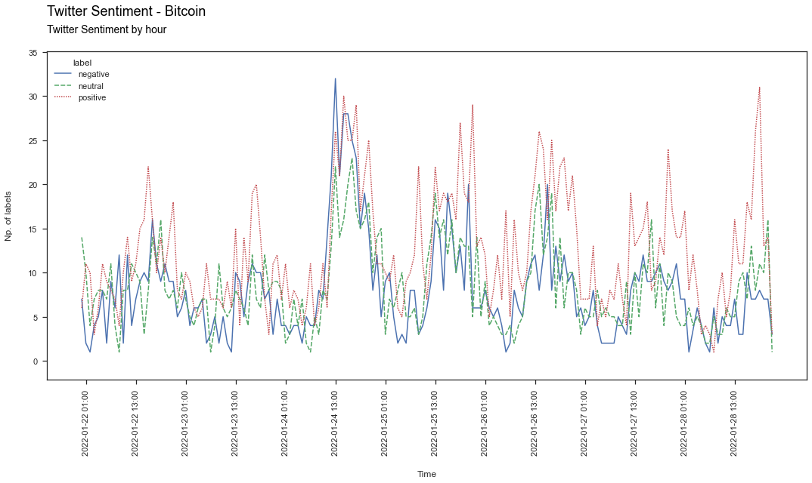

**Cleaning and Preprocessing Data with Natural Language Toolkit (NLTK)**

Keras provides a Tokenizer class that can be fit on the training data, can convert text to sequences consistently by calling the texts_to_sequences() method on the Tokenizer class, and provides access to the dictionary mapping of words to integers in a word_index attribute.

1. Address class weight imbalance by providing class weights with sklearn compute_class_weight function
2. Create and remove typical stopwords and punctuation that occur in English language with nltk.word_tokenize
3. Check tweet length distribution and max value (including stopwords)
4. Vectorize tweets using Tokenizer class from keras.preprocessing.text library by vectorizing a tweets’ text corpus by turning each text into either a sequence of integers
5. Truncate and pad input sequences to be all the same length vectors with keras.preprocessing.sequence.pad_sequences. This function transforms a list of sequences (lists of integers) into a 2D Numpy array of shape (num_samples, num_timesteps). num_timesteps is either the maxlen argument if provided, or the length of the longest sequence in the list.
    - Sequences that are shorter than num_timesteps are padded with value until they are num_timesteps long.
    - Sequences longer than num_timesteps are truncated so that they fit the desired length.

```python
# This class allows to vectorize a text corpus, by turning each text into either a sequence of integers
sequences = t.texts_to_sequences(data['text'])

# Find longest tweet in sequences
def max_tweet():
    for i in range(1, len(sequences)):
        max_length = len(sequences[0])
        if len(sequences[i]) > max_length:
            max_length = len(sequences[i])
    return max_length

max_tweet_len = max_tweet()

#Truncate and pad input sequences to be all the same lenght vectors
padded_data = pad_sequences(sequences, maxlen=max_tweet_len)
padded_data
```


``` 
array([[ 6023,  3194,  6024, ...,     3,     4,  6028],
       [    0,     0,     0, ...,     3,     4,  6029],
       [    0,     0,     0, ...,     3,     4,  6030],
       ...,
       [    0,     0,     0, ...,     3,     4, 15043],
       [    0,     0,     0, ...,     3,     4, 15046],
       [    0,     0,     0, ...,     2,     1, 15049]], dtype=int32)
```

<br />

6. Split data into training and test sets using train_test_split function. Check the shape of data after splitting


```python
# Split data into training and test sets
X_train, X_test, y_train, y_test = train_test_split(padded_data, target, test_size = 0.2, random_state = 0)

y_train = to_categorical(y_train)
y_test = to_categorical(y_test)

# Size of train and test datasets
print('X_train size:', X_train.shape)
print('y_train size:', y_train.shape)
print('X_test size:', X_test.shape)
print('y_test size:', y_test.shape)
```

```
X_train size: (3812, 45)
y_train size: (3812, 3)
X_test size: (954, 45)
y_test size: (954, 3)
```

<br />

**Pre-trained word embedding with Glove**

Word embedding provides a dense representation of words and their relative meanings. They are an improvement over sparse representations used in simpler bag of word model representations. The position of a word within the vector space is learned from text and is based on the words that surround the word when it is used.

The position of a word in the learned vector space is referred to as its embedding.

Two popular examples of methods of learning word embeddings from text include:

- Word2Vec
- GloVe

GloVe stands for global vectors for word representation. It is an unsupervised learning algorithm 
developed by Stanford for generating word embeddings by aggregating global word-word co-occurrence matrix from a corpus.

The GloVe model is trained on the non-zero entries of a global word-word co-occurrence matrix, which tabulates how frequently words co-occur with one another in a given corpus. Populating this matrix requires a single pass through the entire corpus to collect the statistics. For large corpora, this pass can be computationally expensive, but it is a one-time up-front cost.

In addition to these carefully designed methods, a word embedding can be learned as part of a deep learning model. This can be a slower approach, but tailors the model to a specific training dataset[^3].

<br />


**Create embedding matrix and KERAS embedding layer**

The Keras Embedding layer can also use a word embedding learned elsewhere. It is common in the field of Natural Language Processing to learn, save, and make freely available word embeddings.


1. Load the whole Glove embedding file into memory as a dictionary of words to an embedding array. A 50 dimensional version (embedding dimension) will be used.
2. Populate the matrix by iterating over the corpus content
3. Create an embedding layer to be used in the training model using the Embedding function from Keras. 
4. The embedding layer can be seeded with the GloVe word embedding weights.
5. We chose the 50-dimensional version, therefore the Embedding layer must be defined with output_dim set to 50.
6. We do not want to update the learned word weights in this model, therefore we will set the trainable attribute for the model to be False

<br />

**Embdedding layer**

The Embedding layer is initialized with random weights and will learn an embedding for all of the words in the training dataset.

It is a flexible layer that can be used in a variety of ways, such as:

- It can be used alone to learn a word embedding that can be saved and used in another model later.
- It can be used as part of a deep learning model where the embedding is learned along with the model itself.
- It can be used to load a pre-trained word embedding model, a type of transfer learning which is the case here.

The Embedding layer is defined as the first hidden layer of a network. It must specify 3 arguments:

- input_dim: This is the size of the vocabulary in the text data. For example, if your data is integer encoded to values between 0-10, then the size of the vocabulary would be 11 words.
- output_dim: This is the size of the vector space in which words will be embedded. It defines the size of the output vectors from this layer for each word. For example, it could be 32 or 100 or even larger. Test different values for your problem.
- input_length: This is the length of input sequences, as you would define for any input layer of a Keras model. For example, if all of your input documents are comprised of 1000 words, this would be 1000[^3].

<br />

```python
# Input is vocab_size, output is 50
# Weights from embedding matrix, set trainable = False
tweet_num = max_tweet_len

#Create the embdedding layer
embedding_layer = Embedding(input_dim=vocab_size, output_dim=50, weights=[embedding_matrix],
                           input_length = tweet_num, trainable=False)
```

<br />


**Visual representation of Model 4**


**Build and test different recurrent neural network models**

**A recurrent neural network (RNN**) is a type of artificial neural network which uses sequential data or time series data. These deep learning algorithms are commonly used for ordinal or temporal problems, such as language translation, natural language processing (nlp), speech recognition, and image captioning; they are incorporated into popular applications such as Siri, voice search, and Google Translate. Like feedforward and convolutional neural networks (CNNs), recurrent neural networks utilize training data to learn. They are distinguished by their “memory” as they take information from prior inputs to influence the current input and output. While traditional deep neural networks assume that inputs and outputs are independent of each other, the output of recurrent neural networks depend on the prior elements within the sequence. While future events would also be helpful in determining the output of a given sequence, unidirectional recurrent neural networks cannot account for these events in their predictions[^4].

<br />

- Model 1: Simple LSTM Model with regularization, increase dimensionality

    **Long short-term memory (LSTM)**: This is a popular RNN architecture, which was introduced by Sepp Hochreiter and Juergen Schmidhuber as a solution to vanishing gradient problem and to address the problem of long-term dependencies. That is, if the previous state that is influencing the current prediction is not in the recent past, the RNN model may not be able to accurately predict the current state. 

    As an example, let’s say we wanted to predict the italicized words in following, “Alice is allergic to nuts. She *can’t eat peanut butter*.” The context of a nut allergy can help us anticipate that the food that cannot be eaten contains nuts. However, if that context was a few sentences prior, then it would make it difficult, or even impossible, for the RNN to connect the information. 

    To remedy this, LSTMs have “cells” in the hidden layers of the neural network, which have three gates–an input gate, an output gate, and a forget gate. These gates control the flow of information which is needed to predict the output in the network.  For example, if gender pronouns, such as “she”, was repeated multiple times in prior sentences, you may exclude that from the cell state[^4].

```
_________________________________________________________________
Layer (type)                 Output Shape              Param #   
=================================================================
embedding_1 (Embedding)      (None, 45, 50)            752500    
_________________________________________________________________
lstm_2 (LSTM)                (None, 256)               314368    
_________________________________________________________________
dense_2 (Dense)              (None, 3)                 771       
=================================================================
Total params: 1,067,639
Trainable params: 315,139
Non-trainable params: 752,500
_________________________________________________________________
```

```
Training Accuracy: 0.9200
Testing Accuracy:  0.7138
```

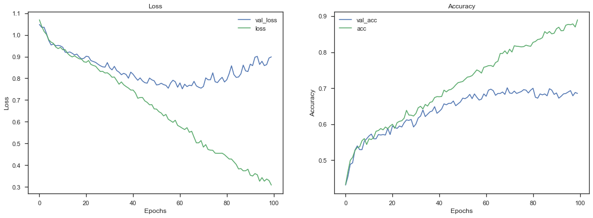

- Model 2: LSTM with regularization, reduce dimensionality

```
_________________________________________________________________
Layer (type)                 Output Shape              Param #   
=================================================================
embedding_1 (Embedding)      (None, 45, 50)            752500    
_________________________________________________________________
lstm_5 (LSTM)                (None, 100)               60400     
_________________________________________________________________
dense_5 (Dense)              (None, 3)                 303       
=================================================================
Total params: 813,203
Trainable params: 60,703
Non-trainable params: 752,500
_________________________________________________________________
```

```
Training Accuracy: 0.7977
Testing Accuracy:  0.7055
```


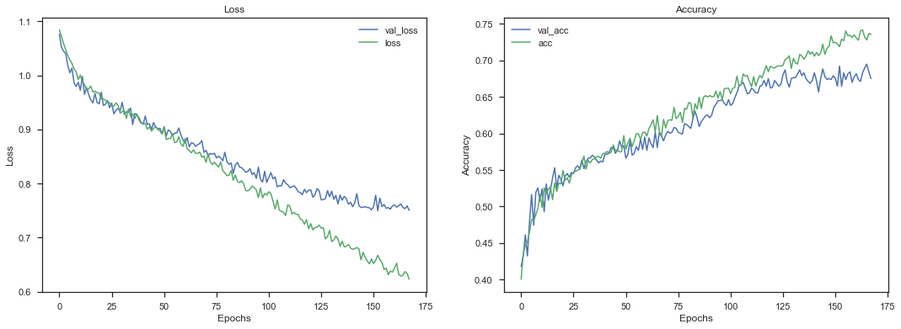


- Model 3: LSTM Layer Stacking

```
_________________________________________________________________
Layer (type)                 Output Shape              Param #   
=================================================================
embedding_1 (Embedding)      (None, 45, 50)            752500    
_________________________________________________________________
lstm_6 (LSTM)                (None, 45, 80)            41920     
_________________________________________________________________
lstm_7 (LSTM)                (None, 20)                8080      
_________________________________________________________________
dense_6 (Dense)              (None, 3)                 63        
=================================================================
Total params: 802,563
Trainable params: 50,063
Non-trainable params: 752,500
_________________________________________________________________
```

```
Training Accuracy: 0.7875
Testing Accuracy:  0.7065
```

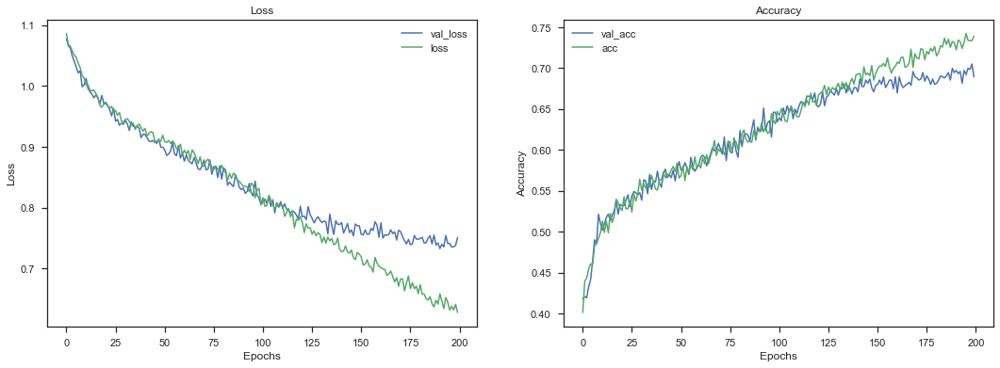


- Model 4: GRU Layer Stacking

     **Gated recurrent units (GRUs)**: This RNN variant is similar the LSTMs as it also works to address the short-term memory problem of RNN models. Instead of using a “cell state” regulate information, it uses hidden states, and instead of three gates, it has two—a reset gate and an update gate. Similar to the gates within LSTMs, the reset and update gates control how much and which information to retain[^4].

```
_________________________________________________________________
Layer (type)                 Output Shape              Param #   
=================================================================
embedding_1 (Embedding)      (None, 45, 50)            752500    
_________________________________________________________________
gru_3 (GRU)                  (None, 45, 64)            22080     
_________________________________________________________________
gru_4 (GRU)                  (None, 32)                9312      
_________________________________________________________________
dense_8 (Dense)              (None, 3)                 99        
=================================================================
Total params: 783,991
Trainable params: 31,491
Non-trainable params: 752,500
_________________________________________________________________
```

```
Training Accuracy: 0.7891
Testing Accuracy:  0.7096
```

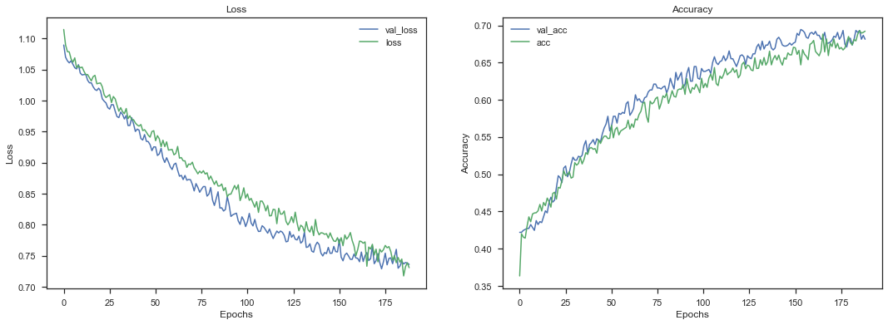


<br />


**General Architecture**
The inputs for each of the following models are our training data which consists of 7,273 with 20% withheld for validation. Each one of these observations contains 50 “features” which correspond to each word in the tweet. Any 0’s indicate the absence of a word.
Each model ends with a dense layer with 3 nodes, because we have 3 possible labels: positive, neutral, or negative. Because we one-hot encoded our labels, we use softmax for this multiclass classification problem to get a probability for each class. Additionally, we use accuracy as our metric, because this is a classification problem. When we use the predict method from Keras, we get a 3 element row vector for each input. Each element corresponds to a probability of one of the 3 labels. Therefore, the label with the highest probability is the predicted outcome. We compile each model with adam and categorical cross entropy.

**Incorporating the GloVe**
GloVe is defined to be an “unsupervised learning algorithm for obtaining vector representations for words”. Pre-trained word vectors data was downloaded from the Stanford University website. The models specifically use the 50 -dimensional embeddings of 1.2M words from 2B tweets. This is represented in a txt file that was parsed to create an index that maps words to their vector representation. Using GloVe data improved the accuracy of the model by about 3-4%.

**Best model**
All models perform quite well, however, Model 4 with two stacked GRU layers, seems to have the best train/validation accuracy based on the training/validation results plot (history_4). 
All models have some difficulties with predicting negative emotions due to the class imbalance - small amount of negative labels in the original dataset. In order to mitigate the class imbalance, we passed the pass the class_wieght argument to the fit() functions. This improved the results and reduced overfitting.

<br />

## 6. Exploratory Data Analysis and Results

Correlations with Price
NLP Process Overview
Time Series and Price Analysis
Sentiment and Text Content Analysis 


**Concatenate all dataframes into one master dataframe**

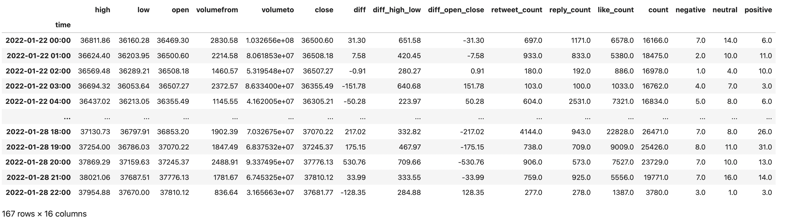

**Let’s explore how the positive and negative tweets affect the price changes**

Based on the scatter matrix below, it's hard to define any significant correlations between the price changes and sentiment labels. The results may change if more data is provided.

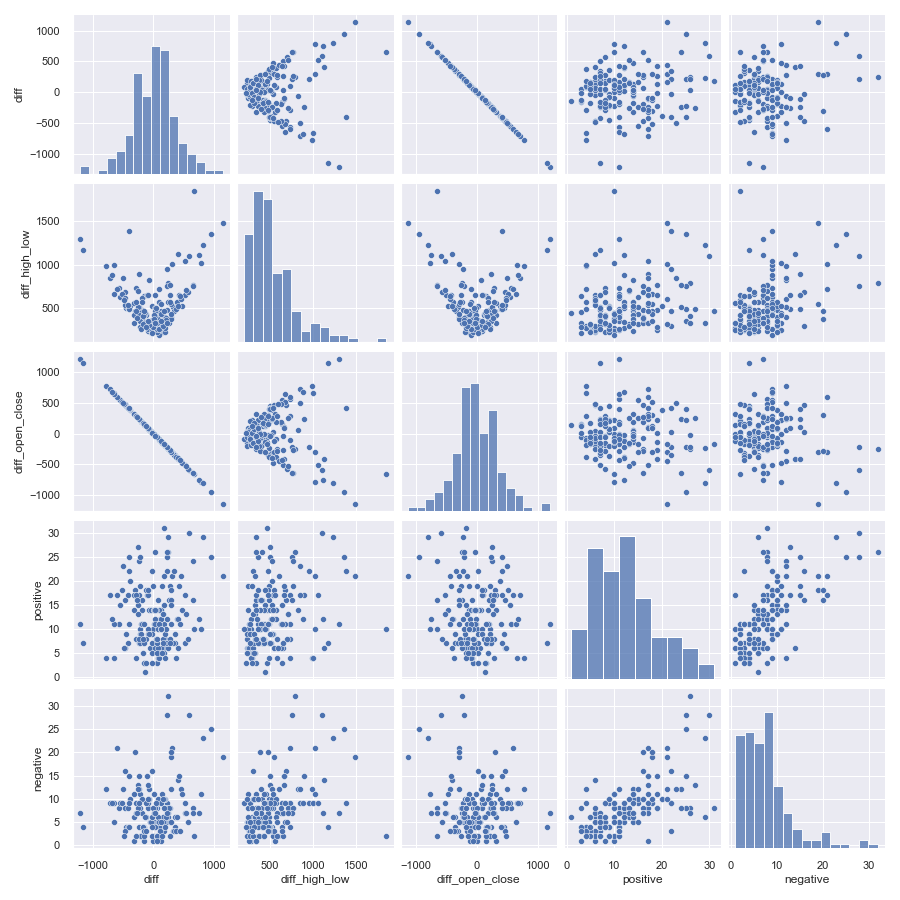


**Correlations**

Based on the correlation heatmap below, the conclusion is that the negative emotions have the biggest impact on the price change and the trading volume. 

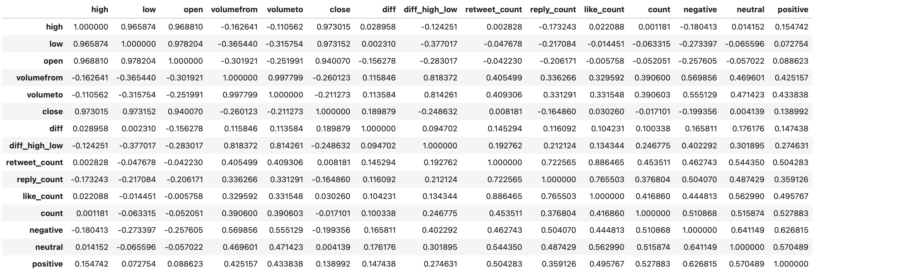

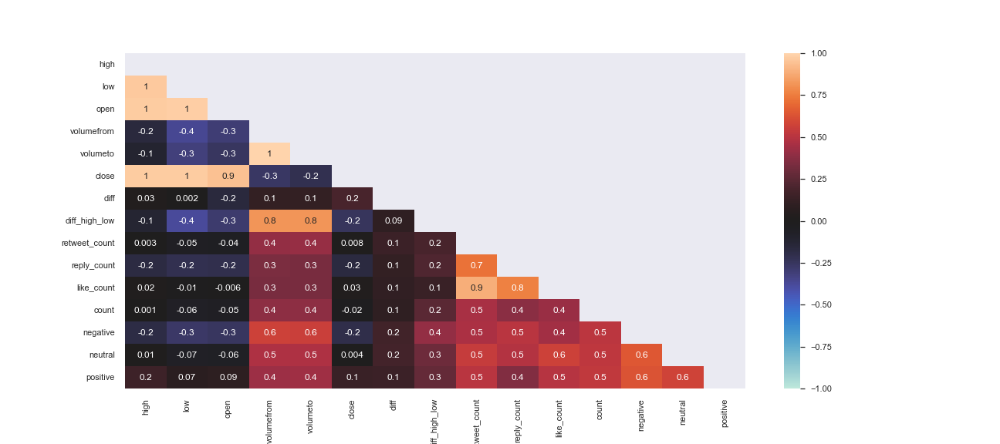


This measures the strength and direction of the linear relationship between two variables. It cannot capture nonlinear relationships between two variables and cannot differentiate between dependent and independent variables.1

A value of exactly 1.0 means there is a perfect positive relationship between the two variables. For a positive increase in one variable, there is also a positive increase in the second variable. A value of -1.0 means there is a perfect negative relationship between the two variables. This shows that the variables move in opposite directions—for a positive increase in one variable, there is a decrease in the second variable. If the correlation between two variables is 0, there is no linear relationship between them.

The strength of the relationship varies in degree based on the value of the correlation coefficient. For example, a value of 0.2 shows there is a positive correlation between two variables, but it is weak and likely unimportant. Analysts in some fields of study do not consider correlations important until the value surpasses at least 0.8. However, a correlation coefficient with an absolute value of 0.9 or greater would represent a very strong relationship[^5].

<br />

**Correlation of frequently occurred words and bigrams with btc price different by hour**


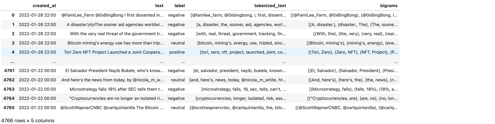

**Frequency of single words by hour**

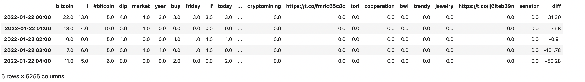

**Frequency of bigrams by hour**

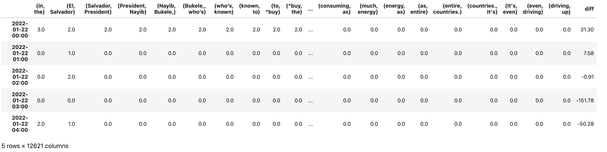

<br />


**Highest correlations single words**

The single words with the highest correlation coefficients are included in the dataframe below. We can see that is word 'trying' with correlation of  0.32. This is not a high value for correlation so we can't say that any of those words is highly coorelated with the price change. That being said, if more data is provided, the correlation might change. 

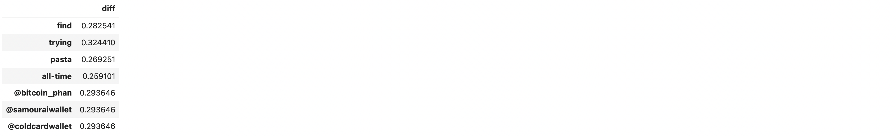

<br />


**Highest correlations for bigrams**


<br />

**Bitcoin price vs Twitter sentiment - plots comparison**

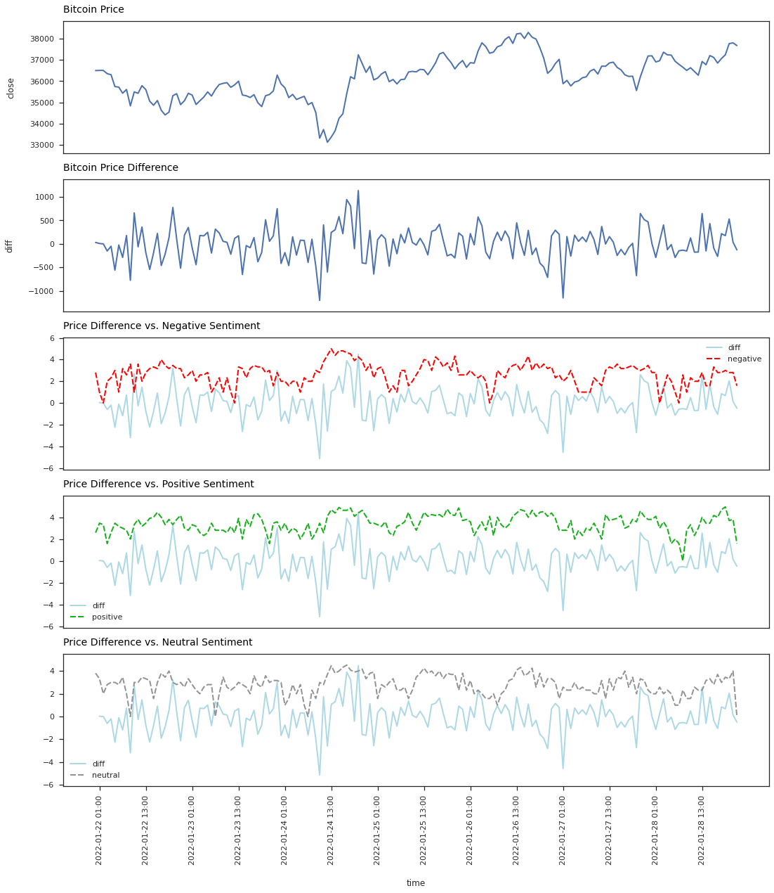

<br />

## 7. Summary and Next Steps

**Summary**

- Best neural newtwork model is Model 4: GRU Layer Stacking with 71% accuracy;

- The hightest correlation for price difference vs. single wrods has 'trying' with 0.32 correlation coefficient;

- The hightest correlation for price difference vs. bigrams has 'are, getting' with 0.27 correlation coefficient;

- Negative sentiment has impact on the trading volume and price volatility;

- Negative sentiment has has bigger impact on the price change then positive and neutral ;

- Tweets' volums does not show any significat impact on the price change (correlation = 0.2);

- Main tools used for posting tweets are Twitter Web App and Twitter for iPhone.


Next Steps

- Gather more data

- Perform analysis of the sentiment and see how it affetcs the price after certain time period. i.e 1 sec, 30 sec, 1min, etc. Analize the correlation coefficients for each period.

- Check more languages for tweets. Certain languages like time zones might be corrleated with certain languages with might have an impact of price fluctuations. 

- Try to predict the price move (increase or decrease) based on certain features like sentiment, author, time using NN or XGBoost

- Visualize price difference vs. sentiment by minute


<br />

References:

[^1]: https://www.linkedin.com/pulse/how-much-can-you-make-trading-bot-my-experience-month-gothireddy

[^2]: https://www.geeksforgeeks.org/python-sentiment-analysis-using-vader/

[^3]: https://machinelearningmastery.com/use-word-embedding-layers-deep-learning-keras/

[^4]: https://www.ibm.com/cloud/learn/recurrent-neural-networks

[^5]: https://www.investopedia.com/terms/c/correlationcoefficient.asp


